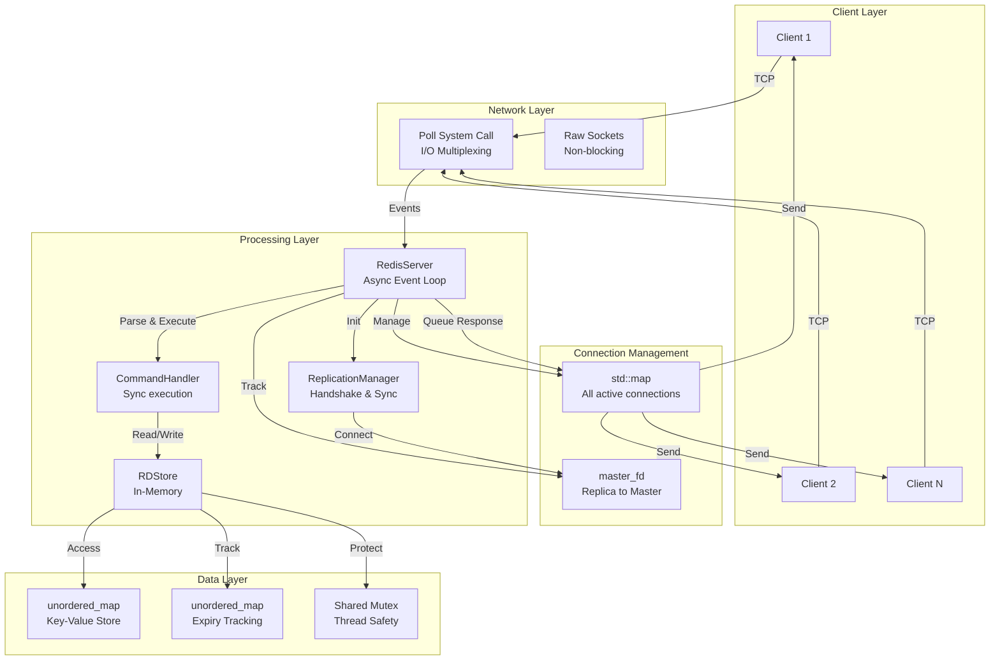
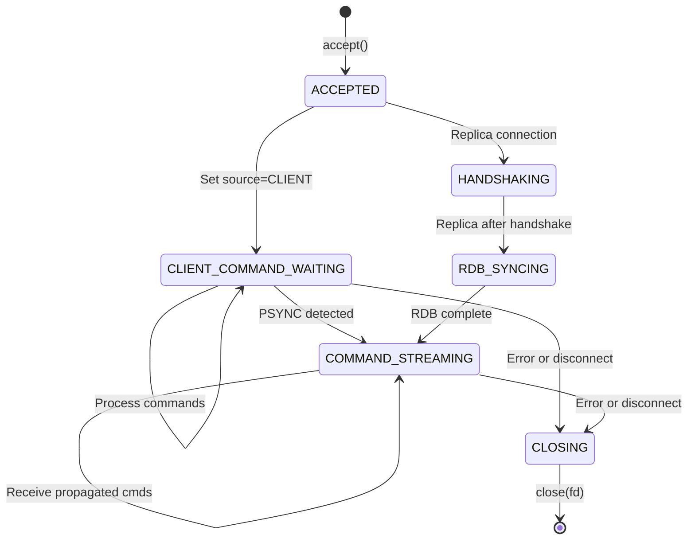
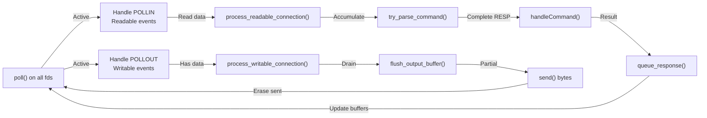
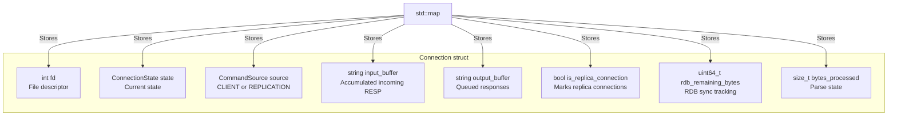
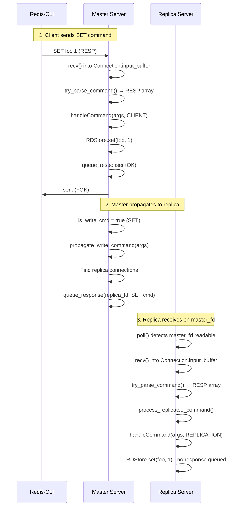
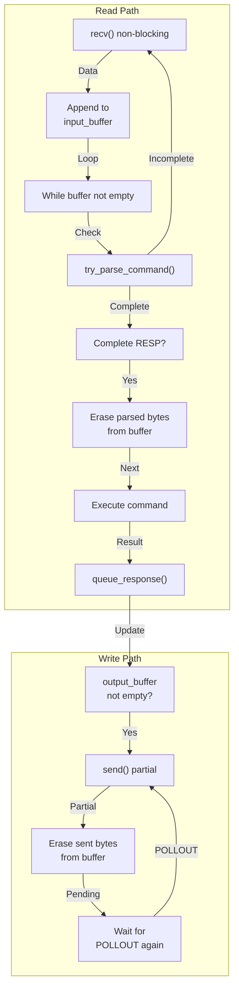
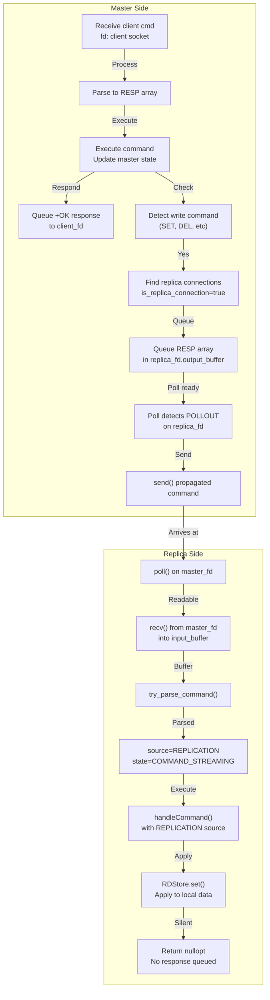
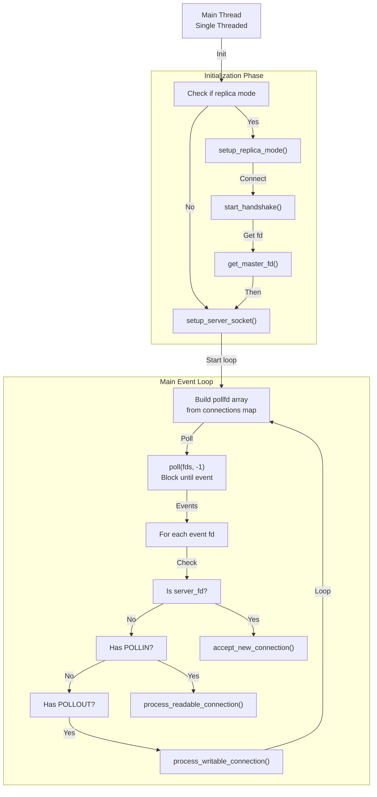

# Current Implementation Architecture Diagrams

## High-Level System Architecture (Async Redis-Style)



## Connection State Machine



## Async Event Loop Pipeline



## Connection Object Architecture



## Data Flow: Client Write Command Propagation



## Buffered I/O Architecture



## Replication Command Processing



## Thread Model (Still Single-Threaded)



## Error Handling & Connection Lifecycle

```mermaid
graph TD
    ACCEPT_FD["accept() new connection"]
    CREATE_CONN["Create Connection object<br/>state=CLIENT_COMMAND_WAITING"]
    STORE_MAP["Store in connections map"]
    
    READABLE_EVENT["POLLIN event"]
    RECV_DATA["recv() from fd"]
    RECV_ERR{recv() result}
    RECV_FAIL["recv() < 0"]
    RECV_CLOSE["recv() == 0<br/>EOF"]
    RECV_DATA_OK["recv() > 0"]
    
    APPEND_BUF["Append to<br/>input_buffer"]
    PARSE_RESP["try_parse_command()"]
    PARSE_OK["Complete RESP?"]
    EXEC_CMD["Execute command"]
    
    WRITABLE_EVENT["POLLOUT event"]
    FLUSH_BUF["Flush output_buffer"]
    SEND_DATA["send() bytes"]
    
    HANDLE_CLOSE["handle_connection_close()"]
    CLOSE_FD["close(fd)"]
    ERASE_MAP["Erase from connections"]
    
    ACCEPT_FD -->|New| CREATE_CONN
    CREATE_CONN -->|Store| STORE_MAP
    STORE_MAP -->|Wait| READABLE_EVENT
    
    READABLE_EVENT -->|Read| RECV_DATA
    RECV_DATA -->|Check| RECV_ERR
    RECV_ERR -->|Error| RECV_FAIL
    RECV_ERR -->|EOF| RECV_CLOSE
    RECV_ERR -->|Data| RECV_DATA_OK
    
    RECV_FAIL -->|Close| HANDLE_CLOSE
    RECV_CLOSE -->|Close| HANDLE_CLOSE
    RECV_DATA_OK -->|Process| APPEND_BUF
    APPEND_BUF -->|Parse| PARSE_RESP
    PARSE_RESP -->|Check| PARSE_OK
    PARSE_OK -->|Incomplete| READABLE_EVENT
    PARSE_OK -->|Complete| EXEC_CMD
    EXEC_CMD -->|Response| WRITABLE_EVENT
    
    WRITABLE_EVENT -->|Ready| FLUSH_BUF
    FLUSH_BUF -->|Send| SEND_DATA
    SEND_DATA -->|Done| READABLE_EVENT
    
    HANDLE_CLOSE -->|Cleanup| CLOSE_FD
    CLOSE_FD -->|Remove| ERASE_MAP
```

<!-- 
## Limitations Overview

```mermaid
graph TD
    subgraph "Performance Issues"
        SINGLE_THREAD["Single Thread<br/>No concurrency"]
        BLOCKING_IO["Blocking recv/send<br/>Per client"]
        NO_THREAD_POOL["No worker threads"]
    end

    subgraph "Scalability Issues"
        POLL_LIMIT["Poll FD limit<br/>~1000 connections"]
        FIXED_BUFFER["1024 byte buffer<br/>Message size limit"]
        NO_ASYNC["No async operations"]
    end

    subgraph "Reliability Issues"
        NO_PERSISTENCE["No data persistence"]
        PASSIVE_EXPIRY["No active expiry cleanup"]
        BASIC_ERROR_HANDLING["Limited error recovery"]
    end

    subgraph "Security Issues"
        NO_AUTH["No authentication"]
        NO_RATE_LIMIT["No rate limiting"]
        BUFFER_OVERFLOW["Potential buffer overflow"]
    end
``` -->
