# Current Implementation Architecture Diagrams

## High-Level System Architecture

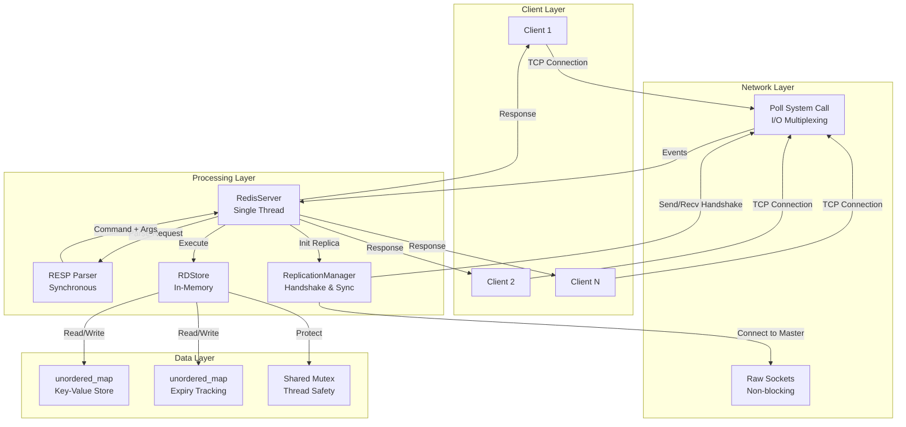

## Component Interaction Flow

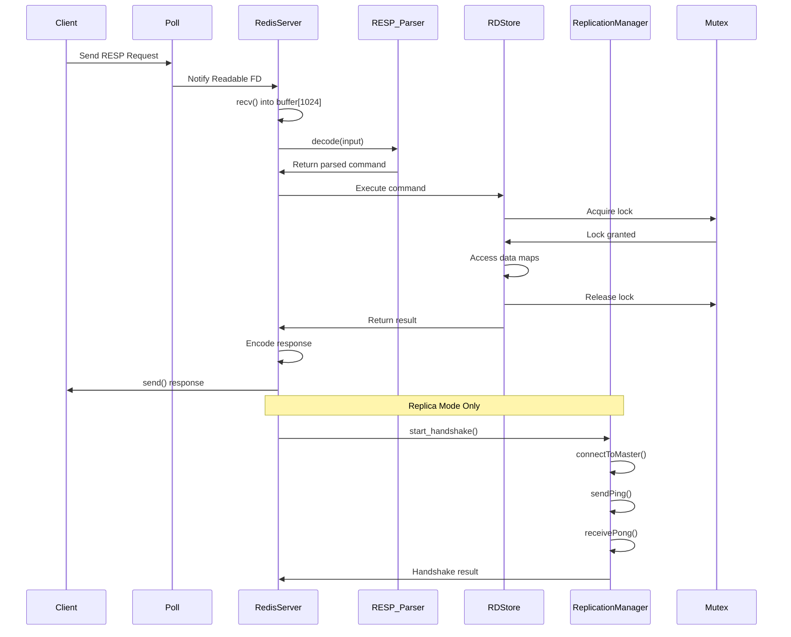

## Data Type Architecture

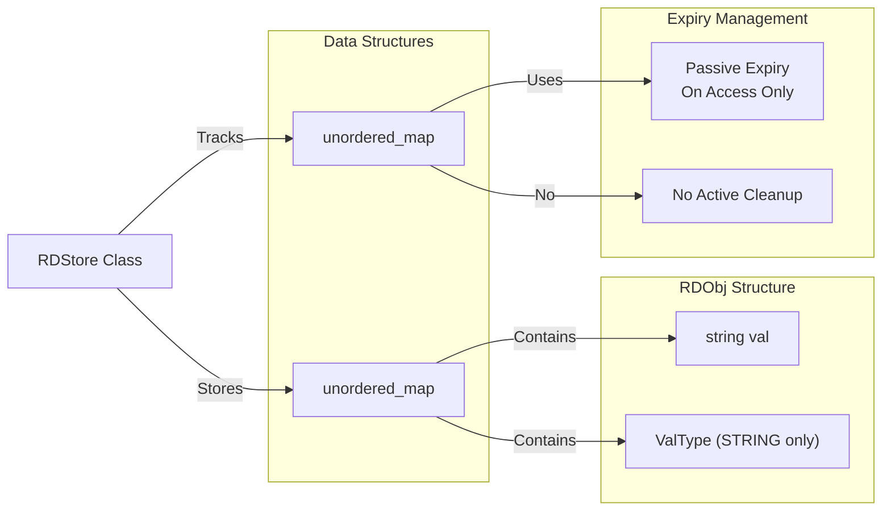

## Thread Model

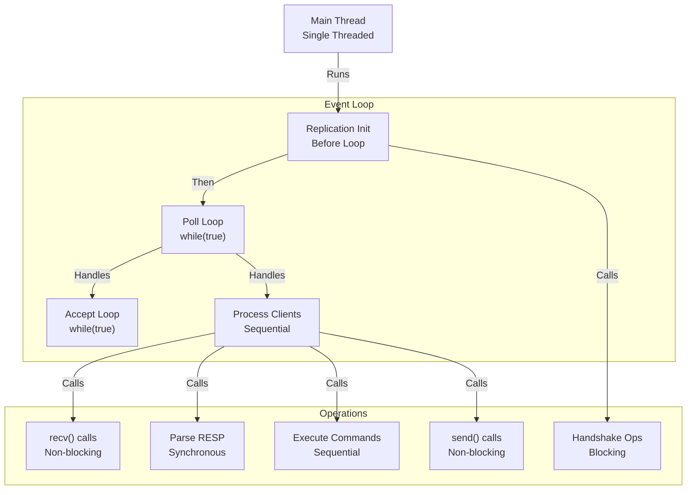

## Memory Layout

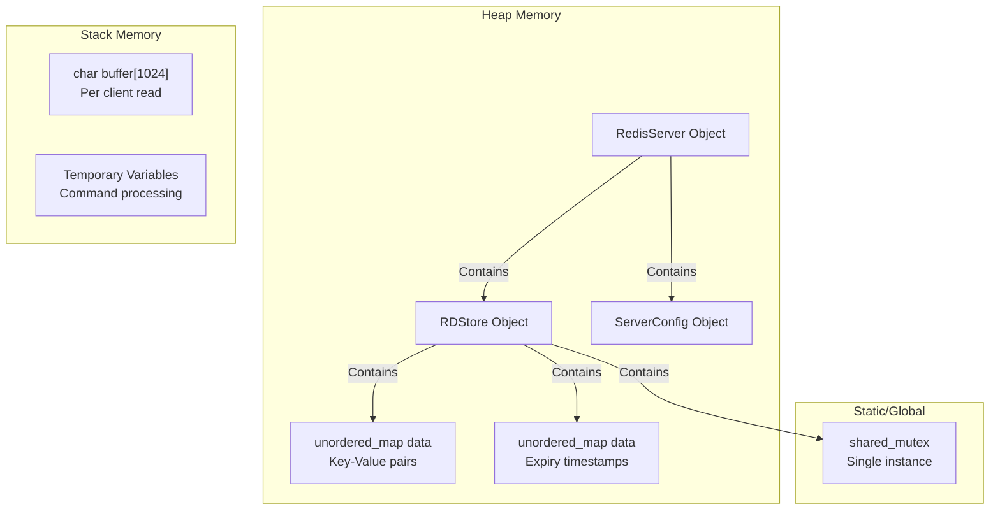

## Command Processing Pipeline

```mermaid
graph LR
    INPUT["Raw TCP Data<br/>Up to 1024 bytes"]
    RECV["recv() into buffer"]
    STRING["Convert to string"]
    DECODE["RESP decode()"]
    VALIDATE["Check ARRAY type"]
    EXTRACT["Extract command<br/>and args"]
    ROUTE["Switch on command<br/>string"]
    EXECUTE["Call RDStore methods"]
    ENCODE["RESP encode()"]
    SEND["send() to client"]

    INPUT -->|TCP Stream| RECV
    RECV -->|Bytes| STRING
    STRING -->|String| DECODE
    DECODE -->|resp_value| VALIDATE
    VALIDATE -->|Valid| EXTRACT
    EXTRACT -->|Command| ROUTE
    ROUTE -->|SET/GET/etc| EXECUTE
    EXECUTE -->|Result| ENCODE
    ENCODE -->|RESP bytes| SEND
```

## Network Architecture

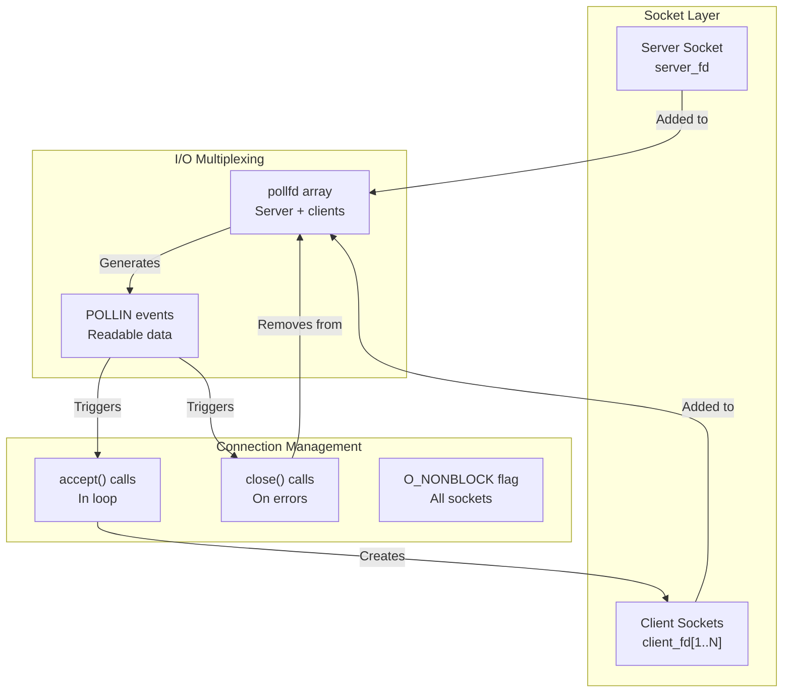

## Storage Access Pattern

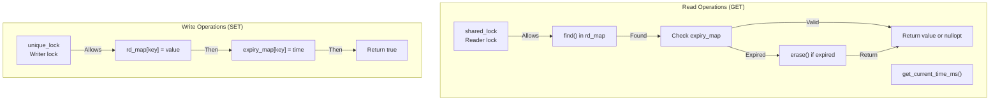

## Error Handling Flow

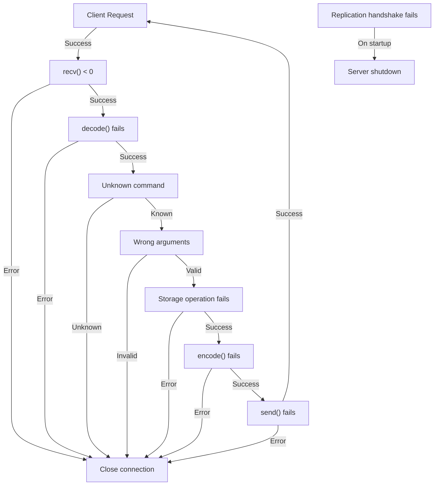

## Configuration Architecture

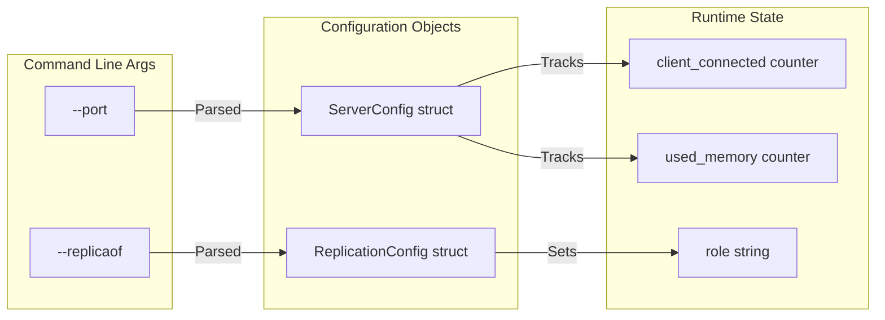

## Replication Architecture

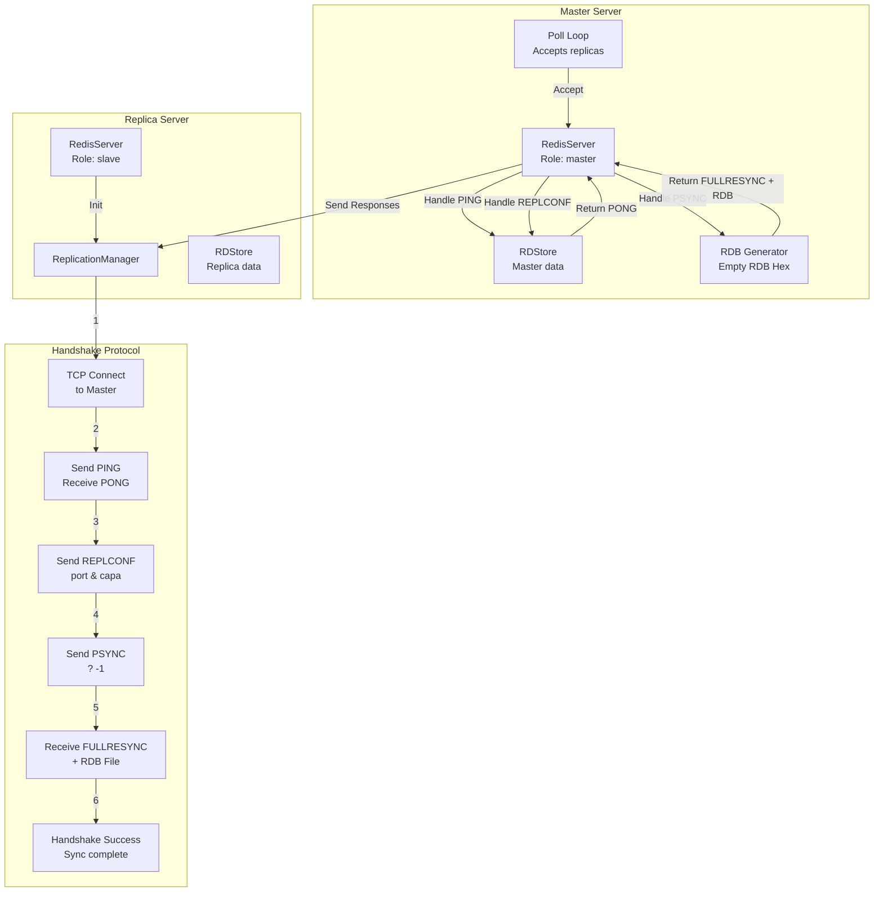

<!-- 
## Limitations Overview

```mermaid
graph TD
    subgraph "Performance Issues"
        SINGLE_THREAD["Single Thread<br/>No concurrency"]
        BLOCKING_IO["Blocking recv/send<br/>Per client"]
        NO_THREAD_POOL["No worker threads"]
    end

    subgraph "Scalability Issues"
        POLL_LIMIT["Poll FD limit<br/>~1000 connections"]
        FIXED_BUFFER["1024 byte buffer<br/>Message size limit"]
        NO_ASYNC["No async operations"]
    end

    subgraph "Reliability Issues"
        NO_PERSISTENCE["No data persistence"]
        PASSIVE_EXPIRY["No active expiry cleanup"]
        BASIC_ERROR_HANDLING["Limited error recovery"]
    end

    subgraph "Security Issues"
        NO_AUTH["No authentication"]
        NO_RATE_LIMIT["No rate limiting"]
        BUFFER_OVERFLOW["Potential buffer overflow"]
    end
``` -->
